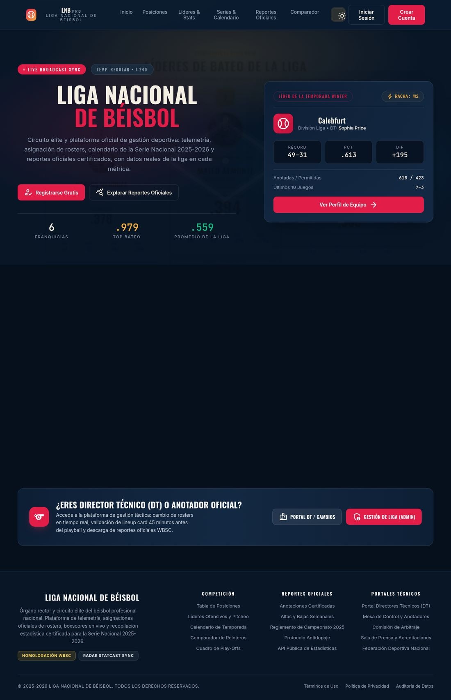
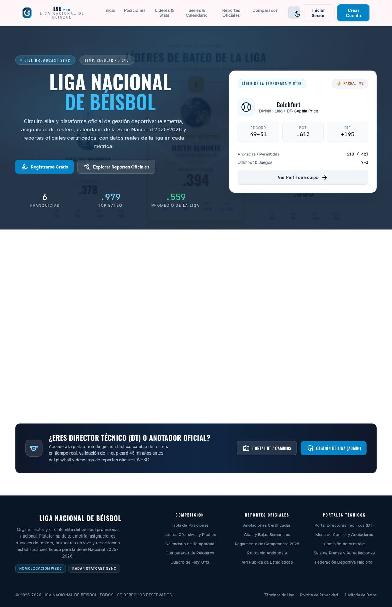
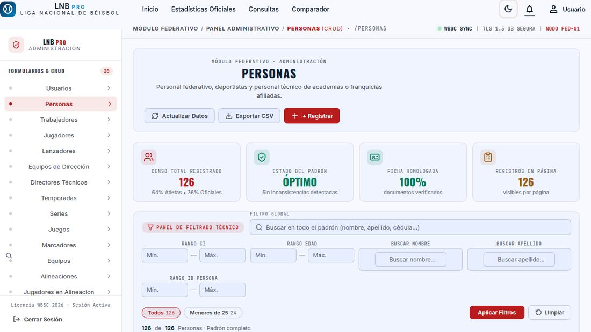
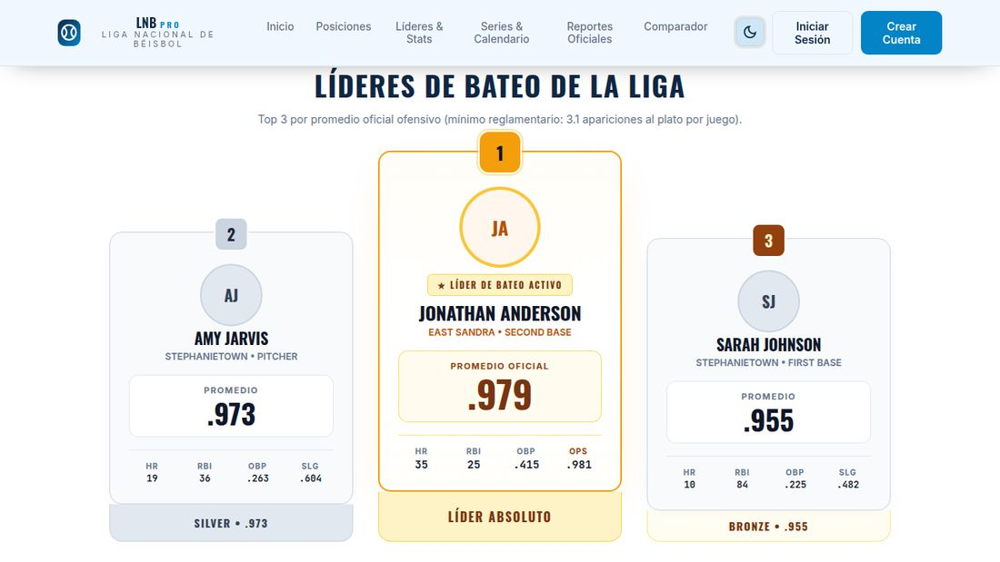

# ⚾ Baseball Manager — Gestión de Campeonatos de Béisbol LNB Pro

Plataforma full-stack para administrar campeonatos de béisbol: **reportes estadísticos con exportación PDF/CSV**, **CRUD completo (18 entidades)**, **autenticación por roles** (Admin, Director Técnico, Usuario General), dashboard de usuario con **radar de stats** y landing pública con `<strong>standings</strong>`, líderes y podium (Sanoscuro/light).

- **Backend**: Django 5.1 + Django REST Framework 3.15 + PostgreSQL (psycopg2)
- **Frontend**: React 18 (CRA) + ECharts (radar/bar charts) + React Router
- **Arquitectura**: Repository + BaseViewSet + Factory Boy (seed) — ver [AGENTS.md](AGENTS.md)

🔗 **Demo en vivo:** [https://baseball-manager-frontend.onrender.com/](https://baseball-manager-frontend.onrender.com/) — accede como invitado o entra con los [Usuarios demo](#usuarios-demo-seed).

---

## ✨ Funcionalidades

| Área | Descripción |
|---|---|
| 🏟️ **Landing pública** | Hero atomista, stats, standings (BarChart), líderes de bateo, jugadores destacados (radar), campeones + podium P1 |
| 📊 **Reportes** | 9 reportes predefinidos (0–8) con filtros dinámicos (report_id + dinamic-filter), shape validated, export PDF/CSV pluggable |
| 🔐 **Auth por roles** | Admin / Director Técnico / Usuario General — login con token, registro público (`/api/register/`) crea rol "Usuario General", dashboard condicionado a sesión |
| ⭐ **Favoritos** | Toggle equipo/equipo y jugador (`/api/user/favorites/team|player/`), panel aislado por usuario, FavoritesPanel con enlaces |
| 🔔 **Notificaciones** | Campana con badge de no leídas (`/api/notifications/`), marcar una (`/read/<id>/`) o todas (`/read-all/`) |
| 🖥️ **CRUD** | 20+ modelos con `BaseRepository` + `BaseViewSet` + `DataTable` frontend |
| 🧾 **Reportes PDF** | Export con branding (reportlab, cabecera dark + marca, página WBSC), CSV |

---

## 🚀 Arranque rápido

### Backend (Django + Postgres)

```bash
# 1. Entorno + dependencias
source python_enviroment/bin/activate   # o tu venv
pip install -e .

# 2. Variables (de .env; si no, usa los defaults de Baseball_Manager/settings.py)
cp .env.example .env  # y rellena DB_NAME, DB_USER, DB_PASSWORD...

# 3. BD (Postgres local o docker)
createdb campeonatos   # si no existe
# o con docker:
# docker run -d --name bp-pg -e POSTGRES_USER=postgres -e POSTGRES_PASSWORD=postgres \
#   -e POSTGRES_DB=campeonatos -p 5432:5432 postgres:16

# 4. Migraciones + seed + servidor
python manage.py makemigrations db_structure api   # solo si cambiaste modelos
python manage.py migrate
python populate_db.py     # sembrar campeonato demo (factories)
python manage.py runserver 127.0.0.1:8000
```

### Frontend (React)

```bash
cd Baseball_Management
npm install
npm start   # servidor en http://localhost:3000 (API proxied a :8000)
```

### Alternativa: todo en Docker (recomendada)

Levanta Postgres + Django + React en un comando (migraciones y seed automáticos):

```bash
docker compose up --build
# backend  → http://localhost:8000
# frontend -> http://localhost:3000
# reset:   docker compose down -v && docker compose up --build
```

### Usuarios demo (seed)

| Rol | Email | Password |
|---|---|---|
| Admin | `lialopez@gmail.com` | `lia` |
| Director Técnico | `director@test.com` | `director` |
| Usuario General | `general@test.com` | `general` |

---

## 🔬 Testing

### Backend

```bash
# Suite unitaria (sin BD) — db_structure y api
python manage.py test db_structure
python manage.py test api

# Suite de integración real (Postgres) — solo cuando INTEGRATION_TESTS=1 (CI/flagged)
INTEGRATION_TESTS=1 python manage.py test api.tests.integration
```

La suite de integración (`api/tests/integration/`) es **autocontenida**: se siembra a sí misma
vía `seed_test_championship()` (factories reales de `populate_db`) contra la BD de test de Django,
por lo que no depende del `populate_db.py` de mano. Endpoints validados: auth (3 roles),
reportes 0/5/6/8 + dinamic-filter (Postgres real), favoritos toggle team/player (add=201/remove=200),
notificaciones (badge, marcar 1, marcar todas).

> ℹ️ Los tests unitarios (`db_structure`) pasan **sin BD sembrada**: los casos de `test_serializers.py`
> que validan PKs (rol/equipo/jugador) se auto-siembran con las factories, y `test_models.py` restaura
> sus mocks de managers en `tearDown` — 96 tests, 0 dependencias de seed manual.

### Frontend

```bash
cd Baseball_Management
npm test -- --watchAll=false    # 14 tests (App, FavoriteButton, NotificationBell, UserDashboard, RadarChart)
npm run lint                    # 0 errores / 0 warnings
```

Los tests de `FavoriteButton`/`NotificationBell`/`UserDashboard` mockean `src/api` y usan
`await apiGet(...)` (no `.json()` → DRF expone `.data` en los clientes).

---

## ☁️ Despliegue en Render (demo pública, gratis, sin tarjeta)

Arquitectura 100 % free: **Static Site** (nunca duerme) + **Web Service API** + **BD Neon
serverless** (gratis, **sin caducidad**). El blueprint `render.yaml` provisiona todo.

### 1. Crear una BD gratis en Neon (no caduca, a diferencia del Postgres de Render)
1. Crea cuenta en https://neon.tech (login GitHub) → proyecto nuevo con la rama `main`.
2. Copia de las credenciales: `host` (p. ej. `ep-xxxx.eu-central-1.aws.neon.tech`), `database`, `user` y `password`.
3. Guarda el password (solo se muestra una vez).

### 2. Desplegar en Render
1. Cuenta en https://render.com (login GitHub, sin tarjeta).
2. **New + → Blueprint** → conecta/elige este repo → Render lee `render.yaml` y crea
   `baseball-manager-frontend` (static), `baseball-manager-api` (docker) y sus env vars.
3. En el servicio API, rellena los valores que faltan (los que el blueprint deja marcados):
   `SECRET_KEY` (cualquiera larga), `DB_PASSWORD` de Neon y `DB_NAME`/`DB_USER`/`DB_HOST`.
4. Aplica el deploy. El backend espera a la BD, migra y **siembra la demo automáticamente**
   solo la primera vez (guard: si `Team` está vacío).

### 3. Verificar dominios (Render puede añadir sufijos si el nombre está ocupado)
- Frontend: `https://baseball-manager-frontend.onrender.com` → abre la landing y `/reporte/average`.
- API: `https://baseball-manager-api.onrender.com/teams/` → devuelve JSON.
- Si Render asignó otra URL, actualiza: `REACT_APP_API_URL` y `CORS_ALLOWED_ORIGINS` en el
  frontend (redeploy estático) y `ALLOWED_HOSTS`/`CORS_ALLOWED_ORIGINS` en la API.

### 3b. Fallback SPA (OBLIGATORIO en Render) — regla de Rewrite en el Dashboard
Render **no lee el `_redirects`** de Netlify. Sin una regla, recargar `/reporte/average`,
`/equipo/1` o cualquier ruta de React Router da **404**. En el Static Site:
1. Dashboard → **`baseball-manager-frontend`** → **Redirects & Rewrites** → **Add Rule**:
   - Source: `/*` · Destination: `/index.html` · Action: **Rewrite**
2. Guardar. Render sirve el archivo físico si existe (assets JS/CSS intactos) y solo
   reescribe a `/index.html` cuando la ruta no tiene recurso — exactamente lo que necesita
   una SPA. El `public/_redirects` queda solo como compatibilidad con Netlify.

### 4. Keep-alive (evitar el cold start del plan free) — OBLIGATORIO para la demo
El Web Service free de Render **se duerme tras 15 min de inactividad** y tarda ~10-20 s en
despertar (mala primera impresión). Lo mantenemos despierto gratis con **UptimeRobot**:
1. https://uptimerobot.com → cuenta free (sin tarjeta).
2. **Add New Monitor** → tipo **HTTP(S)**.
3. URL: `https://baseball-manager-api.onrender.com/teams/` (endpoint raíz que responde rápido).
4. Interval: **Every 5 minutes** → guardar.
Con un ping cada 5 min el backend nunca llega a dormirse (threshold 15 min). El Static Site y
Neon no requieren keep-alive.

Los usuarios demo del seed son los de la sección [Usuarios demo](#usuarios-demo-seed).

> Notas: las migrations están gitignoreadas → el entrypoint hace `makemigrations` en cada
> arranque (idempotente). El seed solo corre si la BD está vacía, así los redeploys son rápidos.

---

## 🗂️ Estructura del repo

```
Baseball_Manager/
├── Baseball_Manager/            # settings Django, urls, wsgi
├── db_structure/                # modelos + repos + serializers + views (CRUD)
├── api/                         # auth, favoritos, notificaciones, dashboard, reportes
│   ├── reports/                 # queries (SQL raw), serializers, exports (PDF/CSV plugin)
│   └── tests/integration/       # suite de integración Postgres real
├── Baseball_Management/         # React (CRA) — componentes, FormulariosCRUD, ui/RadarChart
├── populate_db.py               # seed con factories
├── manage.py
└── docs/
```

---

## 🖼️ Capturas

| Landing dark | Landing light | Admin CRUD |
|---|---|---|
|  |  |  |

| Podium landing (QA) |
|---|
|  |

---

## 🔑 Arquitectura clave (de un vistazo)

- **Repository pattern**: `BaseRepository` (db_structure/generic_classes) + `BaseViewSet` — todo CRUD hereda de 2 clases.
- **Auth**: `FlexibleTokenAuthentication` (`api/authentication.py`) — `CustomUser.is_active=None` hace que el `TokenAuthentication` estándar rechace todo; el flexible omite el chequeo. Login en `api/views.py`.
- **Favoritos/notificaciones**: FK a `db_structure.User` (`user_id`), `request.user` es el user model de auth. **No mezclar** `CustomUser` de auth con `db_structure.User`.
- **Reportes**: SQL raw (CTE) en `api/reports/queries.py`; filtros dinámicos `api/reports/serializers.py`; exporter pluggable `api/reports/exports/kernel.py`.

---

## 📄 Licencia

MIT — ver [LICENSE](LICENSE).

---

## 📖 Más documentación

- [AGENTS.md](AGENTS.md) — guía de desarrollo, gotchas y convenciones.
- [docs/README_EN.md](docs/README_EN.md) — índice/overview en inglés.
- [docs/planning/ROADMAP_PROFESIONAL.md](docs/planning/ROADMAP_PROFESIONAL.md) — roadmap.
